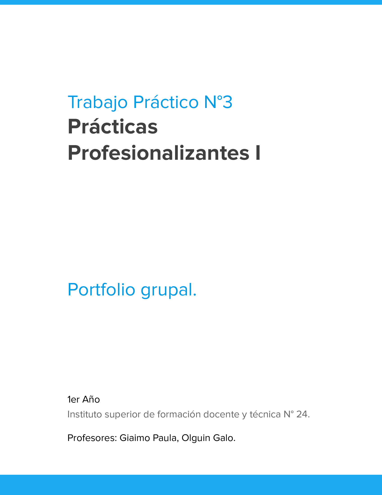

## 3. Trabajo Practico 3 [TP3]

¡Hola!

Les comparto las consignas del TP N° 3, el desafío no es solo técnico, sino también de coordinación. Vamos a construir un Portfolio Grupal, una única web que nos presente a todos como equipo.

Cada uno de ustedes será responsable de su propia página de presentación (NombreApellido.html), pero el sitio final debe verse como uno solo. 

Tengan en cuenta que cada página debe permitir ir al compañero anterior, al siguiente o volver al inicio. 

¡Para esto es vital que se listen por orden alfabético que les dejo abajo ↓↓ !
Camila Barraza
Nahuel Figueroa
Natalia Gomez
Lázaro Janco
Solange Konrad
Federico Lopez
Elias Reinoso
Juan Navarro
Romero Milagros
Luciano Rossi
Esta ordenada por Apellido, pero pongan Nombre Apellido así no queda tan formal 😁

En las consignas les especifiqué el esquema de carpetas a respetar para que los enlaces no se rompan al unificar el proyecto.

¡Cualquier duda, nos vemos en el laboratorio!

[Ver consigna TP N° 3 (PDF)](./pdf/Portfolio-Grupal.pdf)
